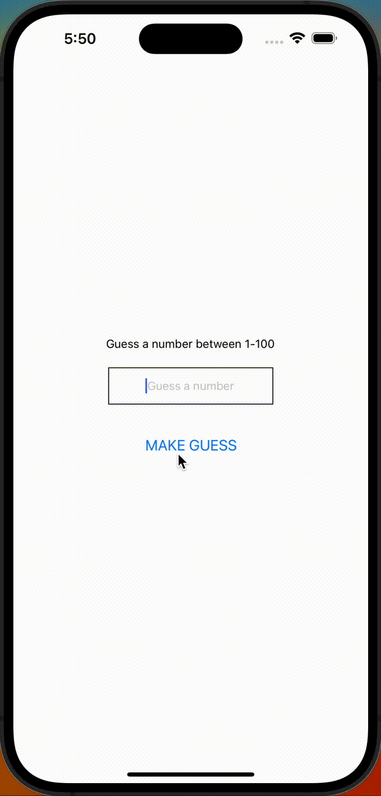

# Numeron arvaus peli

Numeron arvaus on peli, jossa pelaaja arvaa tietokoneen arpomaa numeroa. Pelaaja saa arvata numeroa niin kauan, kunnes hän arvaa oikean numeron. Peli kertoo jokaisen arvauksen jälkeen, onko arvattu numero suurempi vai pienempi kuin oikea numero. Peli kertoo myös, kuinka monta arvausta pelaajalla on mennyt.

# Demo
